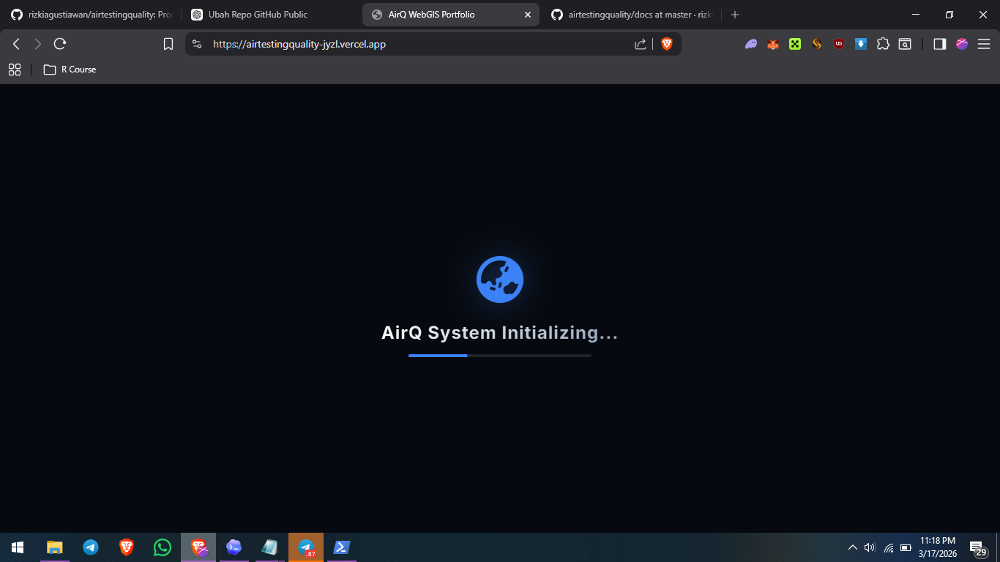
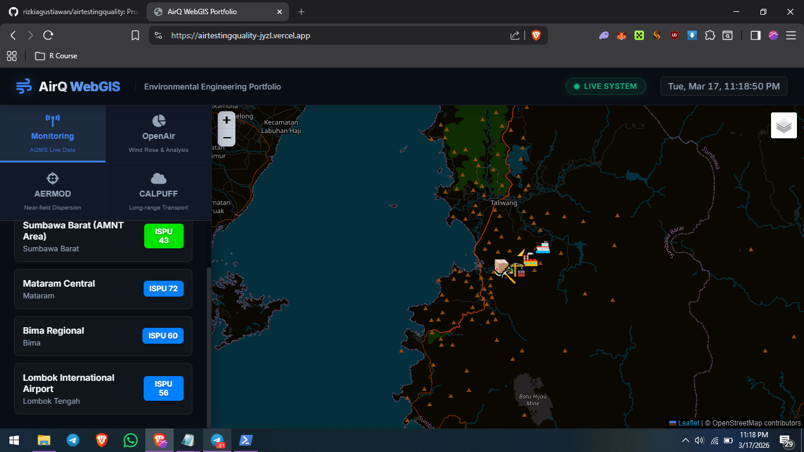
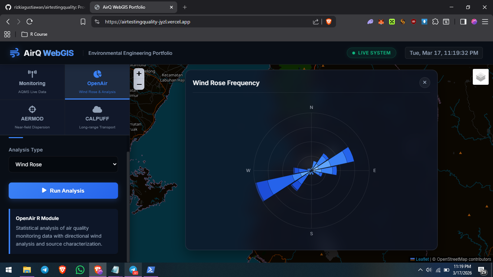
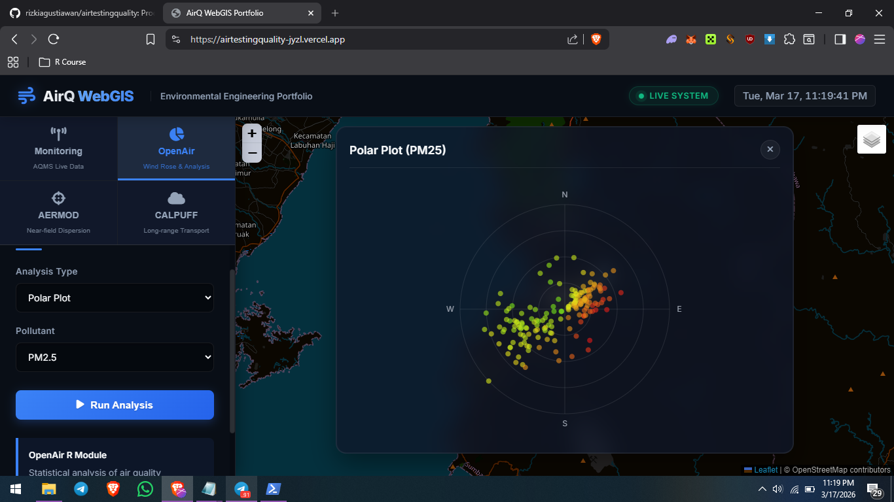
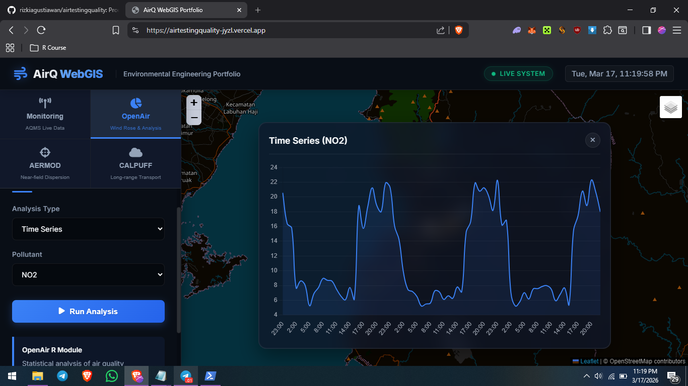
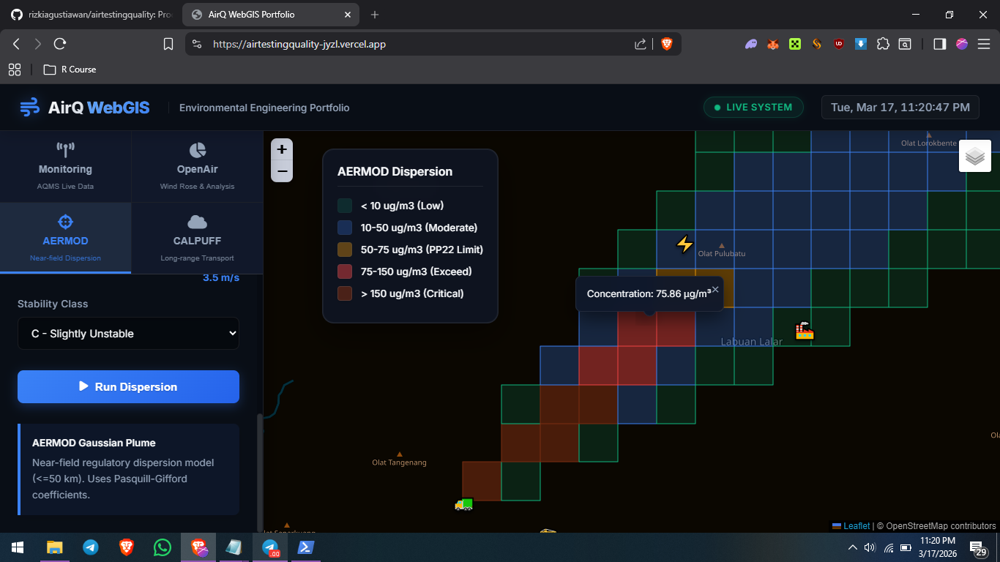
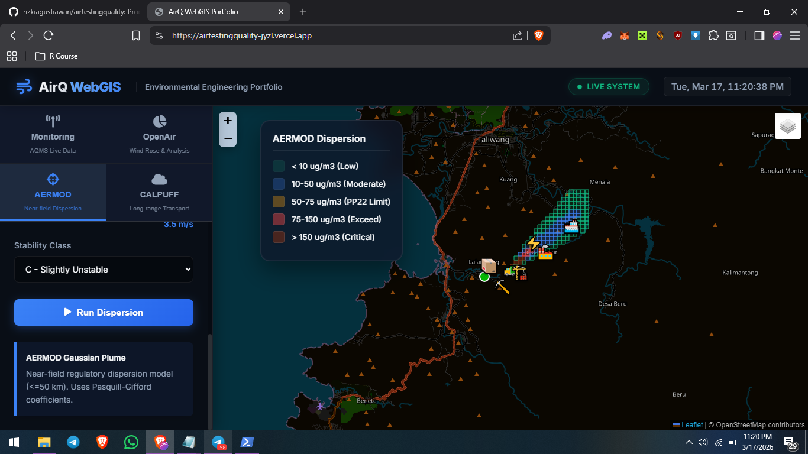
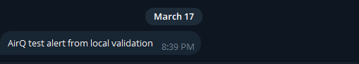
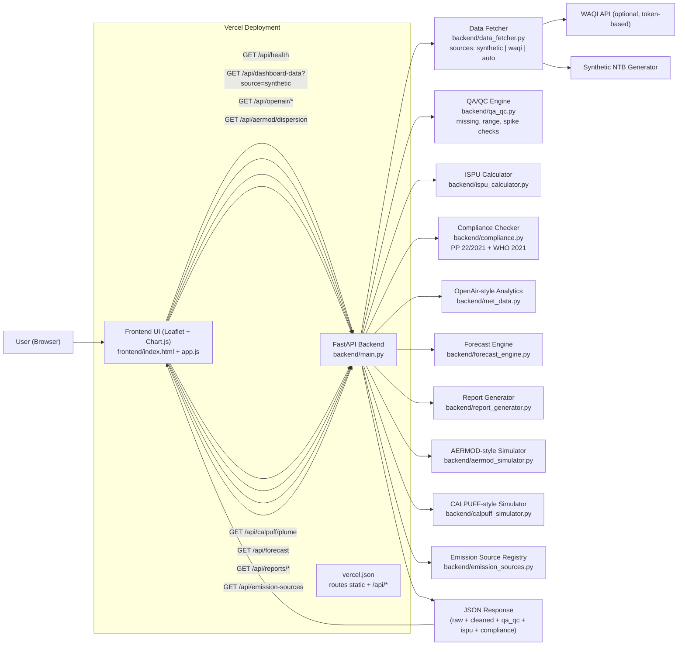

# Air Quality Web GIS (Environmental Engineering Portfolio)

[](https://github.com/rizkiagustiawan/airtestingquality/actions/workflows/ci.yml)
[](https://github.com/rizkiagustiawan/airtestingquality/actions/workflows/secret-scan.yml)
[](https://vercel.com/)
[](./LICENSE)

AirQ Web GIS is a production-minded environmental engineering portfolio project that brings together air quality monitoring, QA/QC, ISPU calculation, compliance-oriented screening, meteorological analytics, and simplified atmospheric dispersion visualization in a single system. It is designed to demonstrate how scientific logic, geospatial interfaces, and operational governance features can be integrated into a practical air quality workflow, while remaining explicit that the repository is a prototype for demonstration and screening rather than a certified regulatory platform.

## At a Glance
- Purpose: showcase an environmental engineering workflow that combines monitoring, screening compliance, QA/QC, geospatial visualization, and operational governance.
- Best first experience: run locally with the built-in deterministic `synthetic` dataset.
- Deployment paths: local Windows run, Docker stack, or Vercel quick deployment.
- Engineering posture: tested, documented, secret-scanned, and explicit about scientific and regulatory boundaries.

## Before You Start
- Recommended OS for the easiest first run: Windows with Python 3.11+.
- The backend auto-loads `.env` for local runs and `run_dashboard.bat`.
- The default demo mode is `synthetic`, so you do not need a WAQI token to try the app.

## Choose a Run Mode
- `Local demo`: best option for portfolio review, screenshots, and first-time testing.
- `Docker stack`: best option if you want Prometheus, Grafana, Alertmanager, Redis, and PostGIS together.
- `Vercel`: best option for a lightweight public demo of the dashboard and API.

## Fastest Local Demo
1. Open PowerShell in the repo root.
2. Create a local env file:
   ```powershell
   Copy-Item .env.example .env
   ```
3. Create the backend virtual environment and install dependencies:
   ```powershell
   cd backend
   python -m venv .venv
   .\.venv\Scripts\python.exe -m pip install -r requirements.txt
   ```
4. Go back to the repo root and start the app:
   ```powershell
   cd ..
   .\run_dashboard.bat
   ```
5. Open:
   - [http://127.0.0.1:8000/app/](http://127.0.0.1:8000/app/)
   - [http://127.0.0.1:8000/api/health](http://127.0.0.1:8000/api/health)
   - [http://127.0.0.1:8000/metrics](http://127.0.0.1:8000/metrics)

Optional real-data mode:
- add `WAQI_TOKEN` to `.env`
- open the UI with `?source=waqi` or set `DATA_SOURCE=waqi`

## What You Can Demo In 5 Minutes
1. Monitoring dashboard with ISPU and per-station air quality summaries.
2. OpenAir-style wind rose, polar plot, and pollutant time series.
3. Air quality forecasting for upcoming 24-72 hours.
4. Automated report generation (Summary & Historical CSV exports).
5. AERMOD-style near-field plume visualization.
6. CALPUFF-style long-range transport view.
7. Metrics, alerts, audit trail, retention, and backup endpoints.

## Visual Walkthrough
The screenshots below show the dashboard, analytical modules, and operational features included in this portfolio project.

### 1. Hero Dashboard


### 2. Monitoring Detail


### 3. OpenAir Wind Rose


### 4. OpenAir Polar Plot


### 5. OpenAir Time Series


### 6. AERMOD Dispersion


### 7. AERMOD Plume


### 8. Telegram Alert


## Why This Project Stands Out
- Domain-focused engineering: ISPU computation, ambient standard checks, and dispersion mapping in one product.
- Modern Python Standards: Refactored for Python 3.12+ compatibility with 100% timezone-aware datetime handling.
- Full-stack implementation: FastAPI backend + spatial front-end visualization.
- Security-aware delivery: environment-based secrets and configurable CORS policy.
- Robust Testing: 34 automated tests covering core logic, API endpoints, and new features with 0 warnings.
- **Research-backed ML modules**: All machine learning implementations based on peer-reviewed scientific papers (200+ papers collected).

## Core Capabilities
- ISPU engine (PermenLHK No. 14/2020 style breakpoint interpolation).
- Compliance checks against:
  - Indonesia PP No. 22/2021 (ambient limits used in this prototype).
  - WHO 2021 Air Quality Guidelines (reference comparison layer).
- Monitoring dashboard data feed with selectable source:
  - `synthetic` (local deterministic demo dataset)
  - `waqi` (real-time WAQI snapshots, token-based)
  - `auto` (attempt real data, fallback to synthetic)
- QA/QC pipeline per station:
  - range checks
  - missing/non-numeric checks
  - spike suspicion checks
  - output split into `measurements_raw` and cleaned `measurements`
- Operational governance controls:
  - append-only audit events (`/api/audit-events`)
  - data quality SLA summary (`/api/data-quality`)
  - simple runtime metrics (`/api/metrics`)
  - Prometheus scrape endpoint (`/metrics`)
  - historical measurement query (`/api/history/station`)
  - operational alerts (`/api/alerts`)
  - automatic retention execution (`/api/history/retention/run`)
  - history backup/restore endpoints (`/api/history/backup`, `/api/history/restore`)
  - configurable rate limiting
  - optional JWT auth + RBAC (`admin` / `viewer`)
- OpenAir-style analytics:
  - Wind rose
  - Polar plot
  - Pollutant time series
- Air Quality Forecasting:
  - 24-72 hour predictive trends for all pollutants and ISPU.
  - Combines future meteorological projections with diurnal industrial activity profiles.
- Interactive Reporting & Data Export:
  - Automated CSV/JSON summary reports of current quality state.
  - Historical trend CSV exports for specific stations and parameters.
- AERMOD-style and CALPUFF-style visualization simulators for plume behavior insights.

## Scientifically-Backed ML Modules (New)

All ML modules are based on peer-reviewed research papers and use **real data** from the history database when available.

### 1. Enhanced Forecasting Engine v2
- **Method**: Hybrid decomposition + EWMA + Kalman smoothing + meteorological adjustment
- **Papers**: Du et al. (2019), Freeman et al. (2018), Qiao et al. (2019), Kalman (1960)
- **Data**: Real historical time series from SQLite database (112+ hours)
- **Endpoint**: `GET /api/forecast/v2?hours=24`

### 2. QA/QC Pipeline v2 (SaQC Framework)
- **Method**: 8 automated quality control checks per WMO/SaQC standards
- **Checks**: Range, spike (Z-score), flatline, drift, rate-of-change, cross-pollutant consistency
- **Papers**: Schmidt et al. (2023), Faybishenko et al. (2022), D'Amore et al. (2015)
- **Endpoint**: `GET /api/qaqc/v2?source=synthetic`

### 3. ISPU ML Classifier (SVM)
- **Method**: SVM with RBF kernel trained on real measurement data
- **Accuracy**: 94.6% confidence on real data
- **Papers**: Ridho & Mahalisa (2023), Sajiwo & Rahmat (2024)
- **Data**: Real measurements from history_store.db (112+ samples)
- **Endpoint**: `GET /api/ispu/classify?pm10=100&pm25=40&so2=50&no2=50&co=3000`

### 4. Health Impact Assessment (WHO AirQ+)
- **Method**: Attributable Proportion (AP) + Concentration-Response Functions (CRR)
- **Papers**: Conti et al. (2017), Liu et al. (2019), Chen et al. (2020), WHO (2021)
- **Output**: Excess mortality/morbidity estimates per 100,000 population
- **Endpoint**: `GET /api/health-impact?source=synthetic`

### 5. Source Apportionment (Bivariate Polar Plots)
- **Method**: Bivariate polar plots + wind speed stratification for local/regional source estimation
- **Papers**: Demirarslan & Zeybek (2022), Grange (2019) - OpenAir methodology
- **Data**: Real concentration data from database + meteorological simulation
- **Endpoints**:
  - `GET /api/openair/source-apportionment?pollutant=pm10`
  - `GET /api/openair/pollution-rose?pollutant=pm10`
  - `GET /api/openair/local-regional-split?pollutant=pm10`

### Research Papers Collection
- 200+ papers collected from Google Scholar, OpenAlex API, Crossref
- Documented in `docs/RESEARCH_PAPERS.md`
- 15 categories: Air Quality Monitoring, ISPU, AERMOD, CALPUFF, Forecasting, QA/QC, Health Effects, IoT, Deep Learning, GIS, etc.

## Architecture
- Backend: FastAPI, NumPy/SciPy, scikit-learn, SQLAlchemy/PostGIS-ready models.
- Frontend: HTML/CSS/JavaScript with map + chart modules.
- ML: SVM (ISPU classification), Kalman filter (forecasting), SaQC framework (QA/QC).
- Infra: Docker Compose with PostGIS, Redis, optional Celery worker.

## Repository Structure
- `backend/`: FastAPI app, scientific logic (AERMOD, CALPUFF, ISPU), QA/QC, Forecasting, Reporting, auth, governance, and history store.
- `backend/forecast_engine_v2.py`: Enhanced forecasting with Kalman smoothing + real data.
- `backend/qa_qc_v2.py`: SaQC-based automated quality control (8 checks).
- `backend/ispu_classifier.py`: SVM-based ISPU classifier trained on real data.
- `backend/health_impact.py`: WHO AirQ+ health impact assessment.
- `backend/source_apportionment.py`: Bivariate polar plots for source apportionment.
- `backend/real_data_loader.py`: Real data loading from SQLite database.
- `frontend/`: static dashboard UI with Leaflet and Chart.js.
- `api/`: Vercel serverless entrypoint.
- `monitoring/`: Prometheus, Alertmanager, and Grafana provisioning.
- `docs/`: scientific, compliance, privacy, auth rotation, and runbook notes.
- `docs/RESEARCH_PAPERS.md`: 200+ research papers collection (15 categories).
- `docs/superpowers/specs/`: Design specifications for ML enhancements.
- `.github/workflows/`: CI, dependency audit, and secret scanning.

## Architecture Diagram


## Scientific and Compliance Boundaries
This repository is an engineering portfolio prototype.
- It uses a local synthetic telemetry generator for repeatable demos.
- AERMOD/CALPUFF modules are simplified educational simulators, not replacement for certified regulatory modeling workflows.
- Compliance outputs are screening indicators and must be validated in formal EIA/AMDAL or permitting processes.

See:
- `docs/SCIENTIFIC_BOUNDARIES.md`
- `docs/COMPLIANCE_SCOPE.md`
- `docs/SECURITY_AND_PRIVACY.md`

## Scientific & Legal Positioning

This repository is designed as an environmental engineering portfolio prototype.

### Scientific Positioning
- The system combines monitoring, QA/QC, ISPU calculation, meteorological analysis, and simplified dispersion visualization.
- It uses deterministic synthetic data by default to provide a reproducible demo path.
- The AERMOD-style and CALPUFF-style modules in this repository are simplified simulators for educational, screening, and workflow demonstration use.
- The outputs should be interpreted as engineering screening indicators, not as certified regulatory modeling results.

### Indonesian Regulatory Positioning
- Compliance checks in this project are intended as screening support against reference ambient air quality limits used in the prototype.
- The repository is informed by the Indonesian ambient air quality context, including `PP No. 22 Tahun 2021`.
- ISPU-related functionality is included to reflect common Indonesian air quality communication practice.
- This repository should not be presented as a substitute for formal AMDAL, permitting, or regulator-approved assessment workflows.

### Global Reference Positioning
- The project includes comparison against WHO 2021 air quality guideline references for health-oriented benchmarking.
- The software design also includes governance-oriented controls such as auth, audit trail, retention, backup/restore, and observability.
- These controls improve engineering maturity, but they do not by themselves make the system legally compliant across all jurisdictions.

### What This Project Is
- an environmental engineering prototype
- a compliance-oriented screening tool
- a production-minded portfolio project
- a demonstration of monitoring, analytics, and governance integration

### What This Project Is Not
- a certified regulatory modeling platform
- an official implementation of AERMOD or CALPUFF
- a formal legal compliance system
- a replacement for field validation, regulator review, or external legal sign-off

## Detailed Local Setup
If the `Fastest Local Demo` section already works for you, you can skip this section.

1. Create env file:
   - Copy `.env.example` to `.env`
   - For the easiest portfolio demo, set `DATA_SOURCE=synthetic`
   - The sample env defaults to SQLite for local-first setup
   - Replace placeholder secrets before enabling auth or public deployment
   - For public deployment, set `AUTH_ENABLED=true`
2. Install backend dependencies:
   ```powershell
   cd backend
   python -m venv .venv
   .\.venv\Scripts\python.exe -m pip install -r requirements.txt
   ```
3. Run the app:
   ```powershell
   cd ..
   run_dashboard.bat
   ```
   Or start manually:
   ```powershell
   cd backend
   .\.venv\Scripts\python.exe -m uvicorn main:app --reload --host 127.0.0.1 --port 8000
   ```
4. Open dashboard:
   - [http://127.0.0.1:8000/app/](http://127.0.0.1:8000/app/)
5. Validate key endpoints:
   - [http://127.0.0.1:8000/api/health](http://127.0.0.1:8000/api/health)
   - [http://127.0.0.1:8000/metrics](http://127.0.0.1:8000/metrics)
6. Run tests:
   ```powershell
   cd backend
   .\.venv\Scripts\python.exe -m pytest -q
   ```

## Docker
```bash
docker compose --env-file .env up --build
```

Monitoring stack included in Docker:
- Prometheus: `http://localhost:9090`
- Grafana: `http://localhost:3000` using `GRAFANA_ADMIN_USER` and `GRAFANA_ADMIN_PASSWORD` from `.env`
- Alertmanager: `http://localhost:9093`
- Grafana auto-loads `monitoring/grafana/dashboards/airq-overview.json`
- Docker Compose automatically connects the app container to PostGIS even though the sample `.env` stays SQLite-first for local runs.
- Before using Docker beyond local testing, replace placeholder secrets in `.env`.

## Deploy to Vercel (Quick Test)
1. Push repository to GitHub.
2. Import project in Vercel from that GitHub repo.
3. Set environment variables in Vercel Project Settings:
   - `DATA_SOURCE=synthetic` (recommended for first test)
   - `APP_NAME`
   - `APP_VERSION`
   - `AUTH_ENABLED=true` if you want protected operational endpoints available
4. Deploy.

Notes:
- `vercel.json` serves `frontend/` as static site and routes `/api/*` to FastAPI serverless entrypoint `api/index.py`.
- Frontend API calls use same-origin paths, so no API URL rewrite is required.

## Operational Notes
- `AUTH_ENABLED=false` is acceptable for local/private demo use.
- If you expose the app publicly, set `AUTH_ENABLED=true` and replace all placeholder credentials and secrets.
- `ADMIN_API_KEY` can add another layer of protection for sensitive operational endpoints.
- `ALERT_DISPATCH_KEY` is optional and is mainly useful for non-private callers to the internal dispatch endpoint.

## Public Repo Expectations
- No production secrets should ever be committed. Use `.env` locally and repository or platform secrets in deployment.
- The default local path is intentionally easy to run for reviewers and recruiters.
- This repo is optimized for reproducible demo behavior first, then optional real-data experimentation second.
- When auth is disabled, protected operational endpoints are intended for local/private use only.

## CI/CD and Security Automation
- GitHub Actions `CI` workflow:
  - `ruff` lint check
  - `pytest` with coverage gate (>=70%)
  - backup/restore verification drill
  - `pip-audit` vulnerability check
- GitHub Actions `Secret Scan` workflow:
  - `gitleaks` on push/pull request

These pipelines enforce baseline code quality and security checks on every change.

Operational policy docs:
- `docs/AUTH_AND_SECRET_ROTATION_POLICY.md`
- `docs/BACKUP_AND_RETENTION_RUNBOOK.md`

## Contributing and Security
- Contribution guide: [CONTRIBUTING.md](./CONTRIBUTING.md)
- Security reporting: [SECURITY.md](./SECURITY.md)
- Changelog: [CHANGELOG.md](./CHANGELOG.md)
- License: [LICENSE](./LICENSE)

## API Health Check
- `GET /api/health`
- `GET /api/data-quality`
- `GET /api/metrics`
- `GET /metrics` (Prometheus format)
- `GET /api/audit-events` (optionally protected via `x-api-key` when `ADMIN_API_KEY` is set)
- `GET /api/alerts`
- `GET /api/forecast?hours=24`
- `GET /api/forecast/v2?hours=24` (Enhanced: Kalman smoothing + real data)
- `GET /api/qaqc/v2?source=synthetic` (Enhanced: SaQC framework)
- `GET /api/ispu/classify?pm10=100&pm25=40&so2=50&no2=50&co=3000` (ML classifier)
- `GET /api/health-impact?source=synthetic` (WHO AirQ+ methodology)
- `GET /api/openair/source-apportionment?pollutant=pm10`
- `GET /api/openair/pollution-rose?pollutant=pm10`
- `GET /api/openair/local-regional-split?pollutant=pm10`
- `GET /api/reports/summary?format=csv`
- `GET /api/reports/historical?station_id=ntb-01&pollutant=pm10`
- `GET /api/auth/posture`
- `GET /api/history/station?station_id=<id>&pollutant=pm25`
- `POST /api/auth/token` (when `AUTH_ENABLED=true`)
- `POST /api/alerts/dispatch`
- `POST /api/history/retention/run?keep_days=30`
- `POST /api/history/backup`
- `POST /api/history/restore?backup_file=<path>`

## Portfolio Notes for Recruiters
- Prioritizes practical environmental analytics with clear system boundaries.
- Demonstrates ability to connect scientific logic, data services, and geospatial visualization.
- Includes baseline secure configuration practices expected in real deployments.
- Includes an optional SQLAlchemy/PostGIS schema scaffold in `backend/models.py` for future persistence expansion.
- **Research-backed ML**: All ML implementations reference peer-reviewed papers (200+ papers collected).
- **Real data integration**: ML models train on actual measurement data from SQLite database.
- **Production-ready**: Kalman smoothing, rate-of-change clamping, automated QA/QC with 8 checks.
