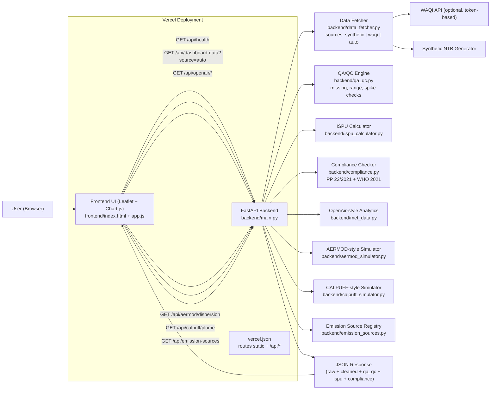

# Air Quality Web GIS (Environmental Engineering Portfolio)

Production-minded air quality platform for environmental monitoring, compliance screening, and atmospheric dispersion visualization.

## Why This Project Stands Out
- Domain-focused engineering: ISPU computation, ambient standard checks, and dispersion mapping in one product.
- Full-stack implementation: FastAPI backend + spatial front-end visualization.
- Security-aware delivery: environment-based secrets and configurable CORS policy.
- Testable core logic: unit and API tests for critical calculations and service health.

## Core Capabilities
- ISPU engine (PermenLHK No. 14/2020 style breakpoint interpolation).
- Compliance checks against:
  - Indonesia PP No. 22/2021 (ambient limits used in this prototype).
  - WHO 2021 Air Quality Guidelines (reference comparison layer).
- Monitoring dashboard data feed with selectable source:
  - `synthetic` (local deterministic demo dataset)
  - `waqi` (real-time WAQI snapshots, token-based)
  - `auto` (attempt real data, fallback to synthetic)
- QA/QC pipeline per station:
  - range checks
  - missing/non-numeric checks
  - spike suspicion checks
  - output split into `measurements_raw` and cleaned `measurements`
- Operational governance controls:
  - append-only audit events (`/api/audit-events`)
  - data quality SLA summary (`/api/data-quality`)
  - simple runtime metrics (`/api/metrics`)
  - Prometheus scrape endpoint (`/metrics`)
  - historical measurement query (`/api/history/station`)
  - operational alerts (`/api/alerts`)
  - automatic retention execution (`/api/history/retention/run`)
  - history backup/restore endpoints (`/api/history/backup`, `/api/history/restore`)
  - configurable rate limiting
  - optional JWT auth + RBAC (`admin` / `viewer`)
- OpenAir-style analytics:
  - Wind rose
  - Polar plot
  - Pollutant time series
- AERMOD-style and CALPUFF-style visualization simulators for plume behavior insights.

## Architecture
- Backend: FastAPI, NumPy/SciPy, SQLAlchemy/PostGIS-ready models.
- Frontend: HTML/CSS/JavaScript with map + chart modules.
- Infra: Docker Compose with PostGIS, Redis, optional Celery worker.

## Architecture Diagram


## Scientific and Compliance Boundaries
This repository is an engineering portfolio prototype.
- It uses a local synthetic telemetry generator for repeatable demos.
- AERMOD/CALPUFF modules are simplified educational simulators, not replacement for certified regulatory modeling workflows.
- Compliance outputs are screening indicators and must be validated in formal EIA/AMDAL or permitting processes.

See:
- `docs/SCIENTIFIC_BOUNDARIES.md`
- `docs/COMPLIANCE_SCOPE.md`
- `docs/SECURITY_AND_PRIVACY.md`

## Quick Start (Local)
1. Create env file:
   - Copy `.env.example` to `.env`
   - Replace placeholders for `SECRET_KEY` and database password.
2. Install backend dependencies:
   ```bash
   cd backend
   pip install -r requirements.txt
   ```
3. Run API server:
   ```bash
   uvicorn main:app --reload
   ```
4. Open dashboard:
   - [http://127.0.0.1:8000/app/](http://127.0.0.1:8000/app/)

## Docker
```bash
docker compose --env-file .env up --build
```

Monitoring stack included in Docker:
- Prometheus: `http://localhost:9090`
- Grafana: `http://localhost:3000` (default `admin/admin`)
- Alertmanager: `http://localhost:9093`

## Deploy to Vercel (Quick Test)
1. Push repository to GitHub.
2. Import project in Vercel from that GitHub repo.
3. Set environment variables in Vercel Project Settings:
   - `DATA_SOURCE=synthetic` (recommended for first test)
   - `APP_NAME`
   - `APP_VERSION`
4. Deploy.

Notes:
- `vercel.json` serves `frontend/` as static site and routes `/api/*` to FastAPI serverless entrypoint `api/index.py`.
- Frontend API calls use same-origin paths, so no API URL rewrite is required.

## Testing
```bash
cd backend
pytest -q
```

## CI/CD and Security Automation
- GitHub Actions `CI` workflow:
  - `ruff` lint check
  - `pytest` with coverage gate (>=70%)
  - `pip-audit` vulnerability check
- GitHub Actions `Secret Scan` workflow:
  - `gitleaks` on push/pull request

These pipelines enforce baseline code quality and security checks on every change.

## API Health Check
- `GET /api/health`
- `GET /api/data-quality`
- `GET /api/metrics`
- `GET /metrics` (Prometheus format)
- `GET /api/audit-events` (optionally protected via `x-api-key` when `ADMIN_API_KEY` is set)
- `GET /api/alerts`
- `GET /api/history/station?station_id=<id>&pollutant=pm25`
- `POST /api/auth/token` (when `AUTH_ENABLED=true`)
- `POST /api/alerts/dispatch`
- `POST /api/history/retention/run?keep_days=30`
- `POST /api/history/backup`
- `POST /api/history/restore?backup_file=<path>`

## Portfolio Notes for Recruiters
- Prioritizes practical environmental analytics with clear system boundaries.
- Demonstrates ability to connect scientific logic, data services, and geospatial visualization.
- Includes baseline secure configuration practices expected in real deployments.
